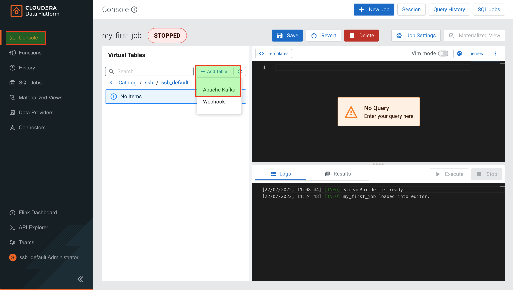
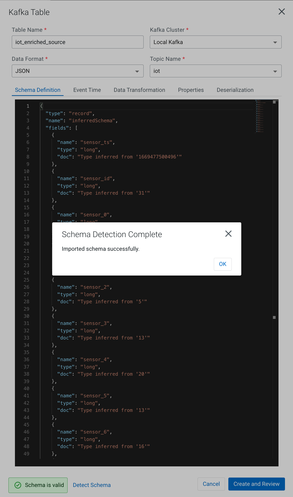
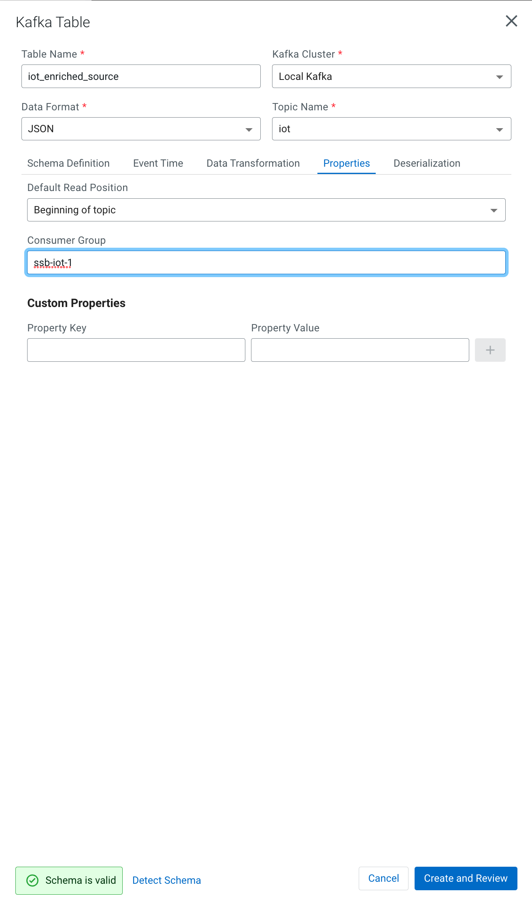
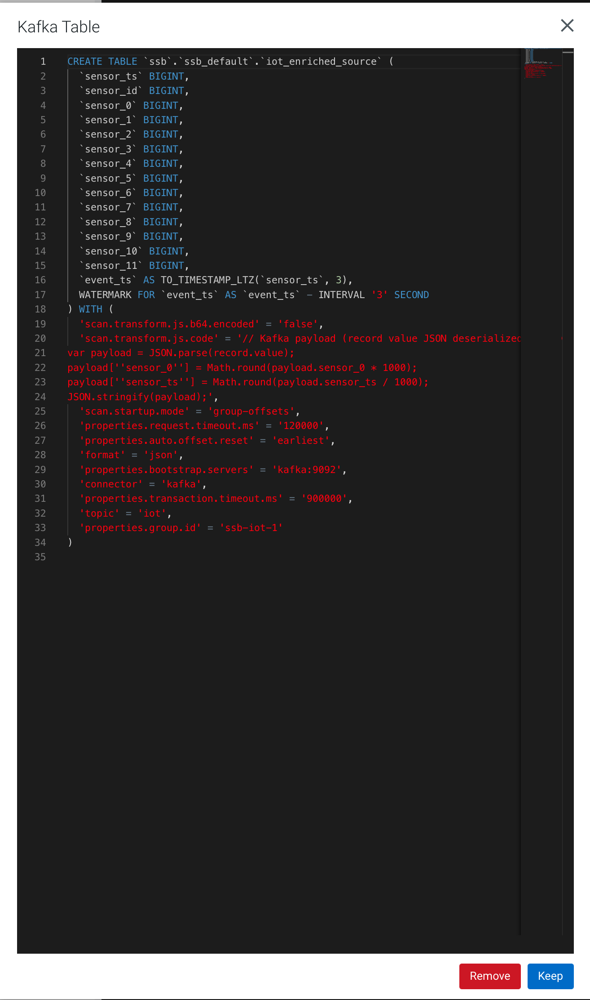
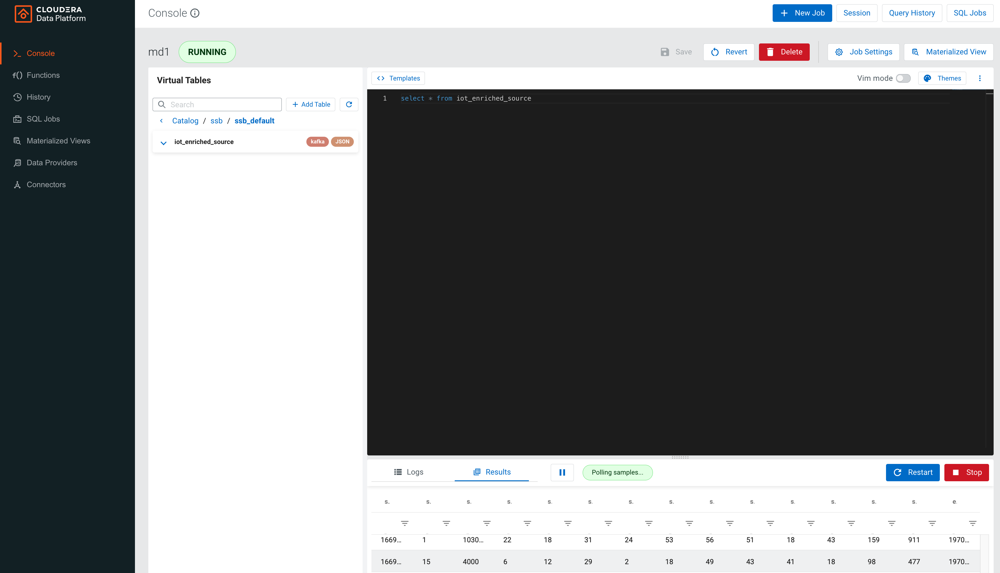
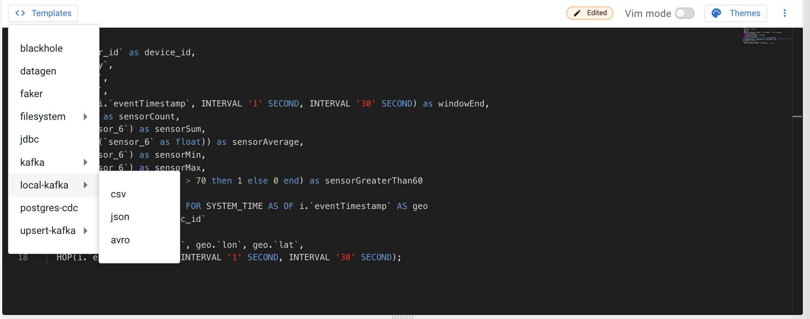
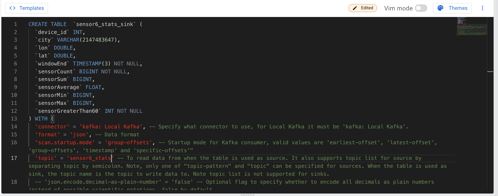
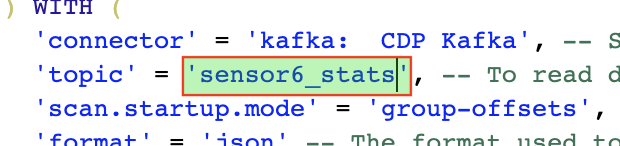

= Querying streams with SQL

NOTE: This lab assumes that the link:streaming_lite.adoc[From Edge to Streams Processing] lab has been completed.

In this workshop you will use SQL Stream Builder to query and manipulate data streams using SQL language. SQL Stream Builder is a powerful service that enables you to create Flink jobs without having to write Java/Scala code.

== Labs summary

* *Step 1* - Create a Source Virtual Table for a topic with JSON messages
* *Step 2* - Run a simple query
* *Step 3* - Computing and storing aggregation results

== Introduction

In this lab, and the subsequent ones, we will use the `iot` topic created and populated in previous labs and contains a datastream of computer performance data points.

So let's start with a straightforward goal: to query the contents of the `iot` topic using SQL to examine the data that is being streamed.

Albeit simple, this task will show the ease of use and power of SQL Stream Builder (SSB).

Open the *ssb_default* project and take a look at the the connection to our local Kafka cluster, which was already defined under *Data Sources > Kafka > Local Kafka*. SSB can be connected to multiple Kafka clusters to bring data from different environments together.

[[lab_1, Lab 1]]
== Lab 1 - Create a Source Virtual Table for a topic with JSON messages

We can _map_ the `iot` topic to a _virtual table_ that we can reference in our query. _Virtual Tables_ on SSB are a way to associate a Kafka topic with a schema so that we can use that as a table in our queries.

We will use a Source Virtual Table now to read from the topic. Later we will look into Sink Virtual Tables to write data to Kafka.

. To create our first Source Virtual Table, click on the *Console* (on the left bar) *> Tables > Add table > Apache Kafka*.
+
image::images/ssb-open-virtual-tables.png[width=800]

. On the *Kafka Table* window, enter the following information:
+
[source,yaml]
----
Virtual table name: iot_enriched_source
Kafka Cluster:      Local Kafka
Data Format:        JSON
Topic Name:         iot
----
+

. On the bottom of the window click *Detect Schema*. SSB will take a sample of the data flowing through the topic and will infer the schema used to parse the content. Alternatively you could also specify the schema in this tab.
+

. Click on the *Event Time* tab to define your time handling. You can specify Watermark Definitions when adding a Kafka table. Watermarks use an event time attribute and have a watermark strategy, and can be used for various time-based operations.
+
The *Event Time* tab provides the following properties to configure the event time field and watermark for the Kafka stream:
+
(In order to make *Input Timestamp Column* visible, you need to disable the *Use Kafka Timestamps* toggle.)

* *Input Timestamp Column* : name of the timestamp column in the Kafka table from where the event time column is mapped. If you wanna use a colume from the event message you have to unselect the box _Use Kafka Timestamp_ first.
* *Event Time Column* : new name of the timestamp column where the watermarks are going to be mapped
* *Watermark Seconds* : number of seconds used in the watermark strategy. The watermark is defined by the current event timestamp minus this value.
+
[source,yaml]
----
Input Timestamp Column: sensor_ts
Event Time Column:      event_ts
Watermark Seconds:      3
----
+

. If we need to manipulate the source data to fix, cleanse or convert some values, we can define *transformations* for the data source to perform those changes. These transformations are defined in Javascript.
+
The serialized record read from Kafka is provided to the Javascript code in the `record.value` variable. The last command of the transformation must return the serialized content of the modified record.
+
The `sensor_0` data in the `iot` topic has a pressure expressed in micro-pascal. Let's say we need the value in pascal scale. Let's write a transformation to perform that conversion for us at the source.
+
Click on the *Data Transformations* tab and copy the following code into the input box:
+
[source,javascript]
----
// Kafka payload (record value JSON deserialized to JavaScript object)
var payload = JSON.parse(record.value);
payload['sensor_0'] = Math.round(payload.sensor_0 * 1000);
payload['sensor_ts'] = Math.round(payload.sensor_ts / 1000);
JSON.stringify(payload);
----
+

. Click on the *Properties* tab, enter the following value for the *Consumer Group* property and click *Save changes*.
+
[source,yaml]
----
Consumer Group: ssb-iot-1
----

+

+
. Click on "Create and Review"
+

+
. Click on "Close" to close to the *Kafka Table* window.
+
NOTE: Setting the *Consumer Group* properties for a virtual table will ensure that if you stop a query and restart it later, the second query execute will continue to read the data from the point where the first query stopped, without skipping data. *However*, if _multiple queries_ use the same virtual table, setting this property will effectively distribute the data across the queries so that each record is only read by a single query. If you want to share a virtual table with multiple distinct queries, ensure that the Consumer Group property is unset.

[[lab_2, Lab 2]]
== Lab 2 - Run a simple query

We have now all that we need to run our first query in SSB. We want to simply query the raw contents of topic to ensure that the everything is working correctly before we proceed to do more complex things.

If your environment is healthy and all the steps from previous labs were completed correctly you should be able to visualize the data with the steps below.

. In the SSB *Explorer*, click the three dots next to *Jobs* and select *New Job*:
+
image::images/ssb-create-job.png[width=800]

. In the *Create New Job* window, enter a *Job Name* for your SSB job (e.g. `query_iot_topic`) or use the random name provided. Then click *Create*:
+
image::images/ssb-set-jobname.png[width=400]

. Copy the following query into the input box:
+
[source,sql]
----
select count(*)
from iot_enriched_source
----
+

. Click *Execute*

. You will see the log messages generated by your query execution in the *Logs* tab.
+
image::images/ssb-sql-execution-logs.png[width=600]

. Once the Flink job was started successfully SSB will switch to the *Results* tab to display the results of your query.
+
image::images/ssb-sql-execution-count.png[width=600]

. Change the SQL query to:
+
[source,sql]
----
select *
from iot_enriched_source
----
+
. Click "Restart" and after a few seconds the SQL Console will start showing the results of the query coming from the `iot` topic.
+
The data displayed on the screen is only a sample of the data returned by the query, not the full data. The column on the right shows the previously defined *Event Time*
+

+
. Well done! Let's increase the level of difficulty and replace the existing SQL with the  *HELLO WORLD in streaming* and counting the events by *sensor_id* - standard SQL with *GROUP BY* and *COUNT*.

+
[source,sql]
----
select sensor_id,
  count(*) as sensorCount
from iot_enriched_source
group by sensor_id
----
+
. After editing the SQL command - click on *Restart*
+

. Once the query returned the results you can stop the job by clicking on the *Stop* button.
+
Now you can save the current sql command by clickling on *Job Actions > Save*.
+
image::images/ssb-sql-save.png[width=800]

WARNING: Make sure to stop your queries to release all resources once you finish this lab. You can double-check that all queries/jobs have been stopped by clicking on the *SQL Jobs* tab. If any jobs are still running, you can stop them from that page.

[[lab_3, Lab 3]]
== Lab 3 - Computing and storing aggregation results
In this lab we will create a query which computes aggregates over 30-seconds windows that slide forward every second. For a specific sensor value in the record (`sensor_6`) it computes the following aggregations for each window:

..  Number of events received
.. Sum of the `sensor_6` value for all the events
.. Average of the `sensor_6` value across all the events
.. Min and max values of the `sensor_6` field
.. Number of events for which the `sensor_6` value exceeds `70`

Let's first create a topic (`sensor6_stats`) where to publish our aggregation results:

.. Navigate to the SMM UI (*Cloudera Manager > SMM* service *>
Streams Messaging Manager Web UI*).
.. On the SMM UI, click the *Topics* tab (image:images/topics_icon.png[width=25]).
.. Click the *Add New* button.
.. Enter the following details for the topic and click *Save* when ready:
... Topic name: `sensor6_stats`
... Partitions: `10`
... Availability: `Low`
... Cleanup Policy: `delete`

Go back to the SSB UI:

. In the SSB *Explorer*, click the three dots next to *Jobs* and select *New Job*:
+
image::images/ssb-create-job.png[width=800]

. In the *Create New Job* window, enter a *Job Name* for your SSB job (e.g. `Sensor6Stats`) or use the random name provided. Then click *Create*:
+
image::images/ssb-set-jobname-sensorstats.png[width=400]

. Copy the following query into the input box:
+
[source,sql]
----
SELECT
  sensor_id as device_id,
  HOP_END(event_ts, INTERVAL '1' SECOND, INTERVAL '30' SECOND) as windowEnd,
  count(*) as sensorCount,
  sum(sensor_6) as sensorSum,
  avg(cast(sensor_6 as float)) as sensorAverage,
  min(sensor_6) as sensorMin,
  max(sensor_6) as sensorMax,
  sum(case when sensor_6 > 70 then 1 else 0 end) as sensorGreaterThan60
FROM iot_enriched_source
GROUP BY
  sensor_id,
  HOP(event_ts, INTERVAL '1' SECOND, INTERVAL '30' SECOND);
----
. Before we can publish events to the new created topic we have to execute this query to build the template.
. Next the `sensor6_stats_sink` table must be created in SSB, mapping it to the `sensor6_stats` Kafka topic.

+
. Since we want the topic format to be JSON, click on *Templates > Local Kafka > JSON*.
+

. This will prepend a `CREATE TABLE` DDL to the SQL script to create a table that matches the structure of your query! Adjust the name e.g. `sensor6_stats_sink`
+

+
. Most of the table properties are already filled in for you. But there's one you must edit before you execute the statement: the `topic` property.
+
Edit the DDL statement and replace the `...` value of the `topic` property with the actual topic name: `sensor6_stats`.
+

+
. You can delete the "Select" statement below the "Create table" statement as we only want to create the sink table.
+
. Click *Execute* to create the sink table
+
. Copy & paste the SQL box again, this time including a `INSERT INTO sensor6_stats_sink` statement on top.
+
[source,sql]
----
INSERT INTO sensor6_stats_sink
SELECT
  sensor_id as device_id,
  HOP_END(event_ts, INTERVAL '1' SECOND, INTERVAL '30' SECOND) as windowEnd,
  count(*) as sensorCount,
  sum(sensor_6) as sensorSum,
  avg(cast(sensor_6 as float)) as sensorAverage,
  min(sensor_6) as sensorMin,
  max(sensor_6) as sensorMax,
  sum(case when sensor_6 > 70 then 1 else 0 end) as sensorGreaterThan60
FROM iot_enriched_source
GROUP BY
  sensor_id,
  HOP(event_ts, INTERVAL '1' SECOND, INTERVAL '30' SECOND);
----
+
. *Execute* the query to write data into the virtual table `sensor6_stats_sink` / the Kafka topic `sensor6_stats`. Keep the job running.
+
. Let’s query the `sensor6_stats` topic to examine the data that is being written to it. 
In the SSB *Explorer*, click the three dots next to *Jobs* and select *New Job*:
+
image::images/ssb-create-job.png[width=800]
+
NOTE: The `sensor6_stats` job will continue to run in the background. You can monitor and manage it through the *SQL Jobs* page.

. Let's query the `sensor6_stats` table to examine the data that is being written to it. First we need to define a Source Table associated with the `sensor6_stats` topic.
+
image::images/ssb-new-virtual-table-2.png[width=800]
+
--
.. In the SSB *Explorer*, click the three dots next to *Virtual Tables* and select *New Kafka Table*:
.. On the *Kafka Table* window, enter the following information:
+
[source,yaml]
----
Table name:         sensor6_stats_source
Kafka Cluster:      Local Kafka
Topic Name:         sensor6_stats
Data Format:        JSON
----
.. Click on *Detect Schema* and wait for the schema to be updated.
.. Click *Create and Review*.
.. Click *Close* to close the *Kafka Table* window.
--
+
image::images/ssb-new-virtual-table-sensor6stats.png[width=600]

. Now we can take a look at the data in the Kafka topic by querying the new virtual table.
In the SSB *Explorer*, click the three dots next to *Jobs* and select *New Job*:
+
image::images/ssb-create-job.png[width=800]

. In the *Create New Job* window, enter a *Job Name* for your SSB job (e.g. `QuerySensorStatsKafkaTopic`) or use the random name provided. Then click *Create*:
+
image::images/ssb-set-jobname-sensorstatskafka.png[width=400]

. Copy the following query into the SQL field and execute it:
+
[source,sql]
----
SELECT *
FROM sensor6_stats_source
----

. After a few seconds you should see the contents of the `sensor6_stats` topic displayed in the *Results* tab.

+
[WARNING]
====
Make sure to stop your queries to release all resources once you finish. CSA CE is limited to a few worker tasks. You can double-check that all queries/jobs have been stopped by clicking on the SQL Jobs tab. If any jobs are still running, you can stop them from that page.
====

. Click on the *Flink Dashboard* link to open the job's page on the dashboard. Navigate the dashboard pages to explore details and metrics of the job execution.
+

== Conclusion

We have now taken data from one topic, calculated aggregated results and written these to another topic.
In order to validate that this was successful we have selected the result with an independent select query.
